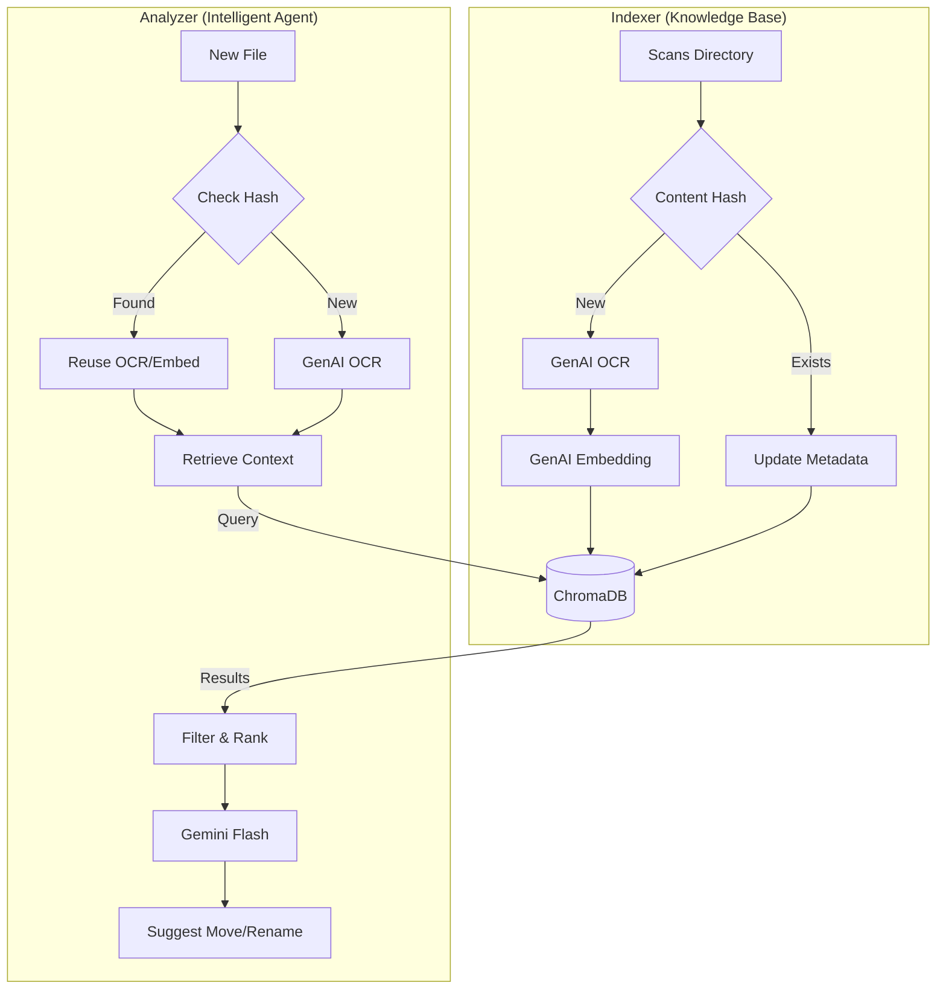

# PDF Organizer

A smart tool to organize and index PDF documents using Google Gemini and ChromaDB.

This project employs a hybrid approach:
1.  **Iterative Retrieval**: Finds similar documents in your existing library to understand your filing conventions.
2.  **GenAI Analysis**: Uses Gemini Flash to suggest the best folder structure and filename for new documents based on content and retrieved context.
3.  **Semantic Indexing**: Indexes document content and embeddings in a local vector database (ChromaDB) for future retrieval.

## Features

*   **Smart Filing**: AI-powered suggestions for folder paths and filenames.
*   **Hash-Based Caching**: Avoids redundant OCR and API calls for already-processed files.
*   **Iterative Retrieval**: Automatically expands search context to find valid examples, ignoring missing or blocklisted files.
*   **Idempotent Indexing**: Handles moved files gracefully by updating metadata instead of creating duplicates.
*   **Interactive / Auto Mode**: Choose to review suggestions or auto-apply high-confidence matches.

## Architecture & Approach
This application is designed as a **Retrieval-Augmented Generation (RAG)** system specialized for file organization.

### 1. The Indexer (Knowledge Base)
The Indexer scans your existing document library to build a "Knowledge Base" of your filing habits.
*   **Hash-Based Idempotency**: Files are identified by content hash (SHA256). Moving a file doesn't trigger re-indexing/re-OCR, only a metadata update.
*   **Pipeline**: `Scan` -> `Check DB` -> `OCR (Gemini 2.5)` -> `Embed (Gemini Embedding)` -> `Vector Store (ChromaDB)`.
*   **Resilience**: Batch state is saved locally, allowing you to resume interrupted scans safely.

### 2. The Analyzer (Intelligent Agent)
The Analyzer is the decision engine that processes new, unorganized files.
*   **Contextual Awareness**: It doesn't just look at the file content. It retrieves the **7 most similar documents** (default) from your existing library to understand *where* similar files live and *how* they are named.
*   **Hybrid Filtering**: It filters out blocklisted or deleted files from the retrieval context to ensure suggestions are always valid.
*   **Caching**: If you analyze a file that is already in the DB (e.g., duplicated download), it reuses the stored OCR text and embeddings instanty.



## Prerequisites

*   **Python**: >= 3.10
*   **uv**: An extremely fast Python package and project manager.
    ```bash
    curl -LsSf https://astral.sh/uv/install.sh | sh
    ```
*   **Google Gemini API Key**: You need an API key from Google AI Studio.

## Installation

We recommend using `uv` for managing the environment.

1.  **Clone the repository**:
    ```bash
    git clone https://github.com/your-username/pdf-indexer.git
    cd pdf-indexer
    ```

2.  **Set up the environment**:
    ```bash
    # Create valid virtual environment
    uv venv

    # Activate it
    source .venv/bin/activate
    ```

3.  **Install dependencies**:
    ```bash
    # Install the package in editable mode
    uv pip install -e .
    ```

## Configuration

Set your Google API key as an environment variable:

```bash
export GOOGLE_API_KEY="your-api-key-here"
```

You can configure the application using a `config.yaml` file in the project directory or at `~/.config/pdforganizer/config.yaml`.

Example `config.yaml`:
```yaml
docs_base_dir: "~/documents/"
index_blocklist:
  - "unconfident/**"
  - "private/**"
```

A template file `config.yaml.example` is provided in the repository.

Common settings to override:
*   `docs_base_dir`: The root directory of your document library.
*   `index_blocklist`: Glob patterns for files to exclude from indexing.
*   `ret_max_neighbors`: Number of examples to retrieve (default: 7).

## Usage

### 1. Analyzer (File Organizer)

Analyze a new PDF and get a suggestion on where to move it.

```bash
# Analyze a single file
python -m pdforganizer.analyzer --file /path/to/downloaded/invoice.pdf

# Auto-apply changes if confidence > 99%
python -m pdforganizer.analyzer --file /path/to/doc.pdf --auto-apply

# Appply changes interactively
python -m pdforganizer.analyzer --file /path/to/doc.pdf --apply
```

### 2. Indexer (Batch Processor)

Scan your document library and index all PDFs into ChromaDB.

```bash
# Index default directory
python -m pdforganizer.indexer

# Index specific directory with larger batch size
python -m pdforganizer.indexer --docs-base-dir /path/to/docs --batch-size 50
```

### 3. OCR Tool

Perform simple OCR on a file and output markdown.

```bash
python -m pdforganizer.ocr_tool input.pdf -o output.md
```

## Development

To set up the development environment with testing and linting tools:

1.  **Install dev dependencies**:
    ```bash
    uv pip install -e ".[dev]"
    ```

2.  **Run tests**:
    ```bash
    pytest
    ```

3.  **Type checking**:
    ```bash
    mypy pdforganizer
    ```

4.  **Formatting**:
    ```bash
    black .
    isort .
    ```

## Project Structure

*   `pdforganizer/`: Main package source.
    *   `analyzer.py`: Logic for analyzing and moving single files.
    *   `indexer.py`: Batch indexing logic.
    *   `utils/`: Helper modules for DB, GenAI, and logging.
*   `hybrid_semantic_db/`: Local ChromaDB storage (auto-generated).
